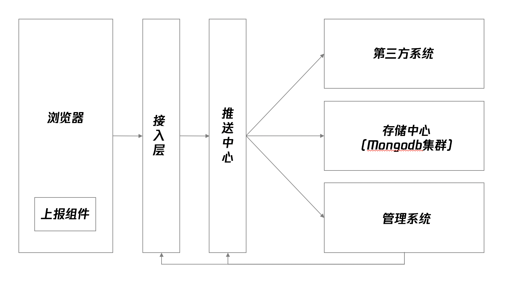
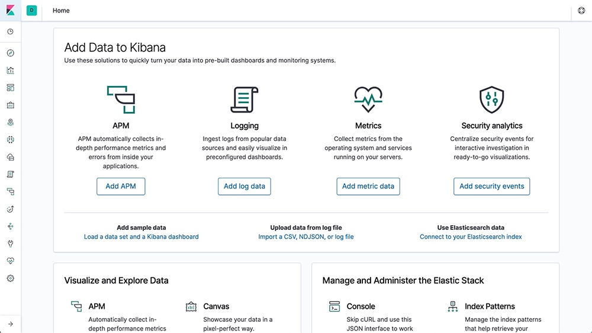

# 错误监控

错误监控是一种“服务”，帮助我们实时监控和修复线上 Bug。

## 为什么

当我们解决了一个又一个Bug，然后进行了一轮又一轮代码审查，之后又跑了一遍又一遍测试，代码终于上线了！然而，我们能够保证上线的代码一定没有Bug吗？似乎没有人可以这样肯定。用户使用应用的画风很可能是这样的：

- 为啥『注册』按键点击了半天没有反应？！
- 为啥『激活邮件』一直木有收到？！
- 为啥狂按F5时页面并没有更新？！
- 为啥APP莫名其妙地闪退了？！
- ……

这时，用户的内心是崩溃的，『这是什么破软件？果断弃了』。我们可怜的程序员如果知道挨骂了，也表示很无语，明明单元测试都通过了啊，覆盖率妥妥的100%有木有。。。其实呢，线上代码出Bug也是很正常的事：

- 一些意想不到的边界条件（内存溢出，死循环，Null, Undefined）;
- 代码的运行环境（各种浏览器，各种手机）千变万化;
- 代码运行依赖的系统比如数据库(MySQL, MongoDB, Redis)偶尔抽风;
- 峰值情况下网络超时，CPU和内存超负荷;
- ……

> Software errors are inevitable. Chaos is not.

思考一：如果热心用户反馈了 bug，该怎么处理？

1. 跪求客服或产品负责人向用户索要各种信息：设备、系统、软件版本、怎么操作的、之前在哪个页面……
2. 很可能没有复现出来，然后挨骂……
3. 复现出来了，今天的任务没完成，又要加班……

思考二：如果没有用户反馈问题，那就代表我们的产品棒棒哒，对不对？

认为“如果用户使用产品遇到问题，用户就会反馈”是比较局限的。最终你会发现只有 1%的用户会反馈问题，然而事实上多得多。如果用户直接放弃使用产品了，你要怎么发现他们的问题呢？

最终答案是**错误监控**，它可以提供专业的 bug 实时监控，让 Debug 变得更加高效而有趣。

- 邮件提醒，更及时地发现错误!
- 智能面板，更方便地管理错误!
- 任务分配，更高效地团队协助!
- 错误搜索，更准确地定位错误！
- ……

参考文献

- [Fundebug上线了！](https://blog.fundebug.com/2016/11/11/fundebug-is-online/)
- [你还在等着用户反馈BUG?](https://blog.fundebug.com/2017/08/30/rely-on-users--to-report-error-is-not-good/)

## 怎么做

ps：通过思考怎么实现一个错误监控系统来认识监控系统及其重要性。

采集 -> 存储 -> 报警 -> 分析

1. 采集：收集异常日志，先在本地做一定的处理，采取一定的方案上报到服务器。
2. 存储：后端接收前端上报的异常日志，经过一定处理，按照一定的存储方案存储。
3. 报警；告警按照一定的级别自动报警，通过设定的渠道，按照一定的触发规则进行。
4. 分析：通过提供一个可视化的数据面板，让系统用户可以看到具体的日志数据，根据信息，发现异常问题根源。

这里按照功能划分，将监控系统的实现拆分为三个部分

- 前端 SDK：负责采集错误日志
- 日志存储：负责存储错误日志
- 管理后台：负责报警和分析日志

### 前端 SDK

错误认知 -> 错误建模 -> 错误监控 -> 错误上报

#### 错误认知

前端一般包含下列类型的错误

- 资源加载错误
- 代码编译错误
- 代码运行时错误
- 接口请求错误
- ...

#### 错误建模

- 异常标识：同样的错误可能会重复上报（来自不同用户），需要对错误进行标识，同样的错误信息统一处理
- 异常级别：info、warn 和 error 等

    当我们监控到异常发生时，可以将该异常划分到“重要——紧急”模型中分为A、B、C、D四个等级。有些异常，虽然发生了，但是并不影响用户的正常使用，用户其实并没有感知到，虽然理论上应该修复，但是实际上相对于其他异常而言，可以放在后面进行处理。

    例如：404 错误可以划分为 warn 级别

- 异常信息：类型、信息和错误栈等
- 用户信息：ID、用户名和联系方式等
- 环境信息：设备、系统、客户端
- 行为信息：所在界面、访问路径、执行了什么操作和调用了什么接口等

#### 监控错误

- 全局捕获：通过全局的接口，将捕获代码集中写在一个地方

    - `window.onerror`
    - `window.addEventListener(‘error’) `
    - `window.addEventListener('unhandledrejection')`
    - 包裹全局异步函数，例如：`setTimeout`、`setInterval`和 `requestAnimationFrame` 等
    - 重写实例方法（Patch），例如：`console.error`、`XMLHttprequest`
    - 框架级别的全局监听，例如：`Vue.config.errorHandler`

- 单点捕获：在业务代码中对单个代码块进行包裹，或在逻辑流程中打点，实现有针对性的异常捕获

    - `try...catch`
    - `promise...catch`
    - 框架提供的错误监听，例如：react 的错误边界实现

ps：除了监控错误外，也需要记录用户的行为信息。

#### 上报策略

前文“错误建模”中提到除了异常报错信息本身，我们还需要记录用户操作日志，以实现场景复原。这就涉及到上报的量和频率问题。如果任何日志都立即上报，这无异于自造的 DDOS 攻击。因此，我们需要合理的上报方案。

- 批量上报：上报时同时触发多个错误时，把错误进行合并上报
- 抽样上报：对于大型网站一定要有
- 黑白名单：过滤一些无关或无法排错的错误类型
- 错误去重：重复错误重复多少次之后就忽略上报（垃圾信息）
- 数据压缩：压缩字符串、节约流量和提升日志上传时间

    lz-string 是一个非常优秀的字符串压缩类库，兼容性好，代码量少，压缩比高，压缩时间短，压缩率达到惊人的 60%。

- ...

参考文献

- [GlobalEventHandlers.onerror](https://developer.mozilla.org/zh-CN/docs/Web/API/GlobalEventHandlers/onerror)
- [How to catch JavaScript Errors with window.onerror (even on Chrome and Firefox)](https://danlimerick.wordpress.com/2014/01/18/how-to-catch-javascript-errors-with-window-onerror-even-on-chrome-and-firefox/)
- [处理JavaScript异常的正确姿势](https://blog.fundebug.com/2017/11/27/proper-error-handling-javascript/)
- [如何处理Express异常？](https://blog.fundebug.com/2017/12/06/handle-express-error/)
- [开源前端脚本错误监控及跟踪解决项目BadJS试用](https://blog.fundebug.com/2019/01/15/try-out-badjs/)

### 日志存储

我们都知道，一个 PV 很高的网站，某一处的前端页面报错，那么上报的日志量就是非常大的，所以在 SDK 层面做了抽样和过滤，但是哪怕是这样，如果你的网站质量不高，那么上报的日志量也会非常大，传统的写入数据库方式或者写缓存方式肯定不行。上报服务一定是要做日志服务的。

#### 实现架构

ps：下图为腾讯 BetterJS 的架构图

- 接入层：支持负载均衡策略，对错误进行本机日志的 IO 写入
- 推送中心：通过拉取的方式把不同前端机收集到的日志做汇总写入存储中心
- 存储中心：对推送中心的写入日志进行存储、聚合和查询

#### 实现方案 —— ELK

日志的最终目的是要使用，由于一般日志的体量都非常大，因此，要在庞大的数据中找到需要的日志记录，需要依赖比较好的搜索引擎。Splunk 是一套成熟的日志存储系统，但它是付费使用的。按照 Splunk 的框架，Elk 是 Splunk 的开源实现，Elk 是 ElasticSearch、Logstash、Kibana 的结合。

- Logstash：一个开源数据收集引擎，具有实时管道功能，可以动态地将来自不同数据源的数据统一起来，并将数据标准化到你所选择的目的；

    

- ElasticSearch 基于 Lucene 的存储、索引的搜索引擎；

    存储日志是一个脏活累活，要面对的问题是数据量大、数据结构不规律
写入并发高和查询需求大等，但是不得不做。对于小应用，单库单表加优化就可以应付。一个成规模的应用，如果要提供更标准高效的日志监控服务，常常需要在日志存储架构上下一些功夫。目前业界已经有比较完备的日志存储方案，主要有：Hbase系，Dremel系，Lucene系等。

- Kibana：对 ElasticSearch 进行可视化，提供查询统计的用户界面。

    

    

### 管理后台

一个完善的日志统计分析工具需要提供各方面的面板，以可视化的方式给日志管理员和开发者反馈信息。

- 报警：告警按照一定的级别自动报警（触发机制），通过设定的渠道（推送渠道），按照一定的触发规则进行（推送频率）。
- 分析：通过提供一个可视化的数据面板，让系统用户可以看到具体的日志数据，根据信息，发现异常问题根源。

    - 查询：应用维度、时间维度、用户维度、环境维度和状态等
    - 展示：错误栈、场景回溯、用户反馈等

参考文献

- [Fundebug支持用户行为回溯](https://blog.fundebug.com/2017/03/29/user-behavior-track/)
- [错误太多？手把手教你清空收件箱](https://blog.fundebug.com/2017/09/15/zero-your-inbox/)

### 扩展思考

#### 换一种方式解决“压缩后的单行文件如何定位源码错误”

正常操作是“打包构建代码时生成 source map，然后上传到错误监控平台”。但是不一定不适用于所有的开发团队，这个方案侵入性太强，部门多，没人用，严重影响性能和效率，增加代码质量。其实解决办法我们换一个思路就好了，我们手上的条件，有报错的压缩的js文件，有错误行和列，有错误信息。那么我们是否可以在可视化平台的后台增加这样一个功能：先定位这个错误是否是一个压缩后的报错，再看这个报错能否根据报错信息快速定位问题，如果都不行。那么你作为开发者，你一定拥有这个压缩后的js的源代码，然后这个js肯定也是你压缩的，对应你肯定也有他的sourceMap文件。通过在后台上传你的sourceMap，甚至上传你的源代码，选择压缩方式，平台本身就可以帮你产生对应的sourceMap，再通过转换，把单行的行和列转换成源码的行和列就可以了。而这些都可以做成全自动的，你只需要把源代码文件拖进web界面即可~！ —— 总结就是再需要的时候可以通过 source map 排查问题。

### TODO

- 性能监控
- 数据脱敏
- 自动产生 bug 工单 

### 参考文献

参考文献

- 《一步一步搭建前端监控系统》

    - [一步一步搭建前端监控系统：JS错误监控篇](https://blog.fundebug.com/2019/07/06/how-to-monitor-javascript-error/)
    - [一步一步搭建前端监控系统：如何监控资源加载错误？](https://blog.fundebug.com/2019/08/17/how-to-monitor-resource-error/)
    - [一步一步搭建前端监控系统：接口请求异常监控篇](https://blog.fundebug.com/2019/07/12/frontend-monitor-http-error/)
    - [一步一步搭建前端监控系统：如何将网页截图上报？](https://blog.fundebug.com/2019/07/26/how-to-sanpshot-web-page/) / [如何实现Web页面录屏？](https://blog.fundebug.com/2019/09/09/how-to-implement-web-video-record/)
    - [一步一步搭建前端监控系统：如何记录用户行为？](https://blog.fundebug.com/2019/08/03/how-to-record-user-behavior/)

- [前端异常监控解决方案研究](https://blog.fundebug.com/2019/08/29/frontend-exception-monitor-research/)
- [浏览器端 JavaScript 异常监控 For Dummies.pdf](https://github.com/kof97/QCon/blob/master/%E5%85%A8%E7%90%83%E8%BD%AF%E4%BB%B6%E5%BC%80%E5%8F%91%E5%A4%A7%E4%BC%9A2016%E4%B8%8A%E6%B5%B7PDF/%E6%B5%8F%E8%A7%88%E5%99%A8%E7%AB%AF%20JavaScript%20%E5%BC%82%E5%B8%B8%E7%9B%91%E6%8E%A7%20For%20Dummies.pdf)
- [前端异常监控系统的落地](https://zhuanlan.zhihu.com/p/26085642)
- [前端 异常处理 以及上报](https://github.com/jerryni/blog/issues/5)
- [前端监控到底怎么做](https://github.com/pengkobe/reading-notes/issues/55)
- [把前端监控做到极致](https://juejin.im/post/5a52f138f265da3e5b32a41b)
- [如何做前端异常监控？](https://www.zhihu.com/question/29953354)
- [前端代码异常监控](http://rapheal.sinaapp.com/2014/11/06/javascript-error-monitor/)
- [前端相关数据监控](http://www.alloyteam.com/2014/03/front-end-data-monitoring/)
- [搭建前端错误监控系统](https://blog.didiyun.com/index.php/2018/11/29/monitor/)
- https://xiaohuazheng.github.io/2017/11/05/js-error-report/
- http://www.alloyteam.com/2017/03/jserror1/
- [前端监控 - 错误监控与收集](https://github.com/kangschampagne/blog/issues/24)
- [前端异常监控解决方案研究](https://cdc.tencent.com/2018/09/13/frontend-exception-monitor-research/)
- [前端错误监控与收集探究](https://juejin.im/entry/5ac471936fb9a028c3690079)
- [前端一站式异常捕获方案(全)](https://jixianqianduan.com/frontend-weboptimize/2018/02/22/front-end-react-error-capture.html)

---

1. 大公司解决方案

    - 腾讯：[BetterJS](https://github.com/BetterJS)

        - https://betterjs.github.io/
        - [前端异常监控 - BadJS](https://slides.com/loskael/badjs/fullscreen#/)
        - [badjs开发指南](https://imweb.io/topic/5b67dfeaf3fbd8d9125fe7ff)
        - [腾讯云 Badjs 镜像使用入门](https://cloud.tencent.com/developer/article/1004564)
        - [浅析badjs源码（前端监控方案）](https://juejin.im/post/5b434402f265da0f7d4edf77)
        - [开源前端脚本错误监控及跟踪解决项目BadJS试用](https://blog.csdn.net/Fundebug/article/details/86489964)
        - [开源前端脚本错误监控及跟踪解决项目-BadJS 试用](https://www.cnblogs.com/wang2650/p/9087824.html)

    - 淘宝：JSTracker

        - [JSTracker 之前端异常数据采集](https://feehi.com/view/936)

    - 阿里巴巴：FdSafe

        - [构建Web前端异常监控系统–FdSafe](https://cloud.tencent.com/info/c5f3d092a243028a3d0da7a5b6a88336.html)

    - 支付宝：[sai.js](https://github.com/saijs)

        - [JavaScript 异常档案](https://saijs.github.io/wiki/)

    - Sentry：[Sentry's Raven.js](https://ravenjs.com/) [sentry-javascript]（https://github.com/getsentry/sentry-javascript

2. 要怎么搭建错误监控平台？

    - 前端 SDK：错误拦截，代理监控，上报策略
    - 错误日志存储和查询
    - 错误日志可视化平台
    - 错误预警
    - ...

3. 前端 SDK 的设计开发

    - 错误拦截（window.onerror）

        - 异常系统介绍

            [JavaScript Errors 指南](https://mp.weixin.qq.com/s/e4_AdSWMxl1BXLfMl-sAgA)

            [Top 10 JavaScript errors from 1000+ projects (and how to avoid them)](https://rollbar.com/blog/top-10-javascript-errors/)

        - 全局错误捕获 —— 思考有哪些错误会触发全局错误捕获事件？
        - 怎么利用 window.onerror 上报错误到监控平台？ —— 全局错误捕获存在哪些问题（例如：跨域和兼容性问题）？

    - 代理监控
    - 上报策略
    - ...
    - 

4. 错误存储和查询

    - 错误的存储机制

        - 可以使用写入数据库方式或者写缓存方式吗？ —— 采用日志服务
        - 如何解决日志服务不好做实时处理的问题？ —— 日志量通常很大，对日志做一些排序，汇总，聚合，查询等操作，会非常耗时。
        - 现有的解决方案：

            - 前端机（指服务层，有负载均衡策略），如：PHP，NodeJS，将日志写入本地日志文件
            - 总日志服务器通过拉取的方式把不同前端机收集到的日志做汇总写入 ElasticSearch

    - 错误日志的查询机制

        使用 ElasticSearch 的 API 进行聚合，查询等操作，完成日志的实时可看，实时可查，以及统计和汇总分析。

5. 监控日志可视化

    - 用户管理
    - 权限管理
    - 错误聚合以及展示
    - 错误详情展示

    开源实现

    - [kibana](https://elasticsearch.cn/topic/kibana)
    - [sentry](https://sentry.io/organizations/learning-w5/issues/)

6. 监控日志预警

    [sentry](https://sentry.io/organizations/learning-w5/issues/)

## 解决方案

| 产品\特性 | 支持平台 | 是否开源 |
| --- | --- | --- |
| [Sentry](https://sentry.io) | JavaScript、Node.js、Java、PHP、GO。。。 | 是 |
| [Rollbar](https://rollbar.com) | JavaScript、Node.js、Java、PHP | 否 |
| [Bugsnag](https://www.bugsnag.com) | JavaScript | 否 |
| [logrocket](https://logrocket.com) | JavaScript | 否 |
| [FrontJS](https://www.frontjs.com/) | JavaScript、小程序 | 否 |
| [FunDebug](https://www.fundebug.com) | JavaScript、Nodejs、RN、小程序 | 否 |

其他

- [badjs-report](https://github.com/BetterJS/badjs-report)
- https://trackjs.com

## 应用案例

- [Fundebug抓到了这个Bug](https://blog.fundebug.com/2016/12/07/fundebug-catch-the-bug/)
- [我是这样发现ISP劫持HTTP请求的](https://blog.fundebug.com/2017/05/10/isp-hijack-http/)
- [我是这样搞懂一个神奇的BUG](https://blog.fundebug.com/2017/09/06/fundebug-user-behavior-help-debug/)
- [10个JavaScript常见BUG及修复方法](https://blog.fundebug.com/2017/11/15/top_10_bugs_and_fixing_method/)
- [详解1000+项目数据分析出来的10大JavaScript错误](https://blog.fundebug.com/2018/03/12/top-10-javascript-errors-from-1000-projects/)
- [窥视各大网站到底有没有的BUG？](https://blog.fundebug.com/2018/07/16/inspect_website_bugs/)
